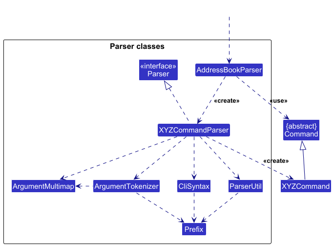

* Table of Contents
{:toc}

--------------------------------------------------------------------------------------------------------------------

## **Acknowledgements**

* {list here sources of all reused/adapted ideas, code, documentation, and third-party libraries -- include links to the original source as well}

--------------------------------------------------------------------------------------------------------------------

## **Setting up, getting started**

Refer to the guide [_Setting up and getting started_](SettingUp.md).

--------------------------------------------------------------------------------------------------------------------

## **Design**

:bulb: **Tip:** The `.puml` files used to create diagrams are in this document `docs/diagrams` folder. Refer to the [_PlantUML Tutorial_ at se-edu/guides](https://se-education.org/guides/tutorials/plantUml.html) to learn how to create and edit diagrams.

### Architecture

The ***Architecture Diagram*** given above explains the high-level design of the App.

Given below is a quick overview of main components and how they interact with each other.

**Main components of the architecture**

**`Main`** (consisting of classes [`Main`](https://github.com/se-edu/addressbook-level3/tree/master/src/main/java/seedu/address/Main.java) and [`MainApp`](https://github.com/se-edu/addressbook-level3/tree/master/src/main/java/seedu/address/MainApp.java)) is in charge of the app launch and shut down.
* At app launch, it initializes the other components in the correct sequence, and connects them up with each other.
* At shut down, it shuts down the other components and invokes cleanup methods where necessary.

The bulk of the app's work is done by the following four components:

* [**`UI`**](#ui-component): The UI of the App.
* [**`Logic`**](#logic-component): The command executor.
* [**`Model`**](#model-component): Holds the data of the App in memory.
* [**`Storage`**](#storage-component): Reads data from, and writes data to, the hard disk.

[**`Commons`**](#common-classes) represents a collection of classes used by multiple other components.

**How the architecture components interact with each other**

The *Sequence Diagram* below shows how the components interact with each other for the scenario where the user issues the command `delete 1`.

Each of the four main components (also shown in the diagram above),

* defines its *API* in an `interface` with the same name as the Component.
* implements its functionality using a concrete `{Component Name}Manager` class (which follows the corresponding API `interface` mentioned in the previous point.

For example, the `Logic` component defines its API in the `Logic.java` interface and implements its functionality using the `LogicManager.java` class which follows the `Logic` interface. Other components interact with a given component through its interface rather than the concrete class (reason: to prevent outside component's being coupled to the implementation of a component), as illustrated in the (partial) class diagram below.

The sections below give more details of each component.

### UI component

The **API** of this component is specified in [`Ui.java`](https://github.com/se-edu/addressbook-level3/tree/master/src/main/java/seedu/address/ui/Ui.java)

The UI consists of a `MainWindow` that is made up of parts e.g.`CommandBox`, `ResultDisplay`, `PersonListPanel`, `StatusBarFooter` etc. All these, including the `MainWindow`, inherit from the abstract `UiPart` class which captures the commonalities between classes that represent parts of the visible GUI.

The `UI` component uses the JavaFx UI framework. The layout of these UI parts are defined in matching `.fxml` files that are in the `src/main/resources/view` folder. For example, the layout of the [`MainWindow`](https://github.com/se-edu/addressbook-level3/tree/master/src/main/java/seedu/address/ui/MainWindow.java) is specified in [`MainWindow.fxml`](https://github.com/se-edu/addressbook-level3/tree/master/src/main/resources/view/MainWindow.fxml)

The `UI` component,

* executes user commands using the `Logic` component.
* listens for changes to `Model` data so that the UI can be updated with the modified data.
* keeps a reference to the `Logic` component, because the `UI` relies on the `Logic` to execute commands.
* depends on some classes in the `Model` component, as it displays `Person` object residing in the `Model`.

### Logic component

**API** : [`Logic.java`](https://github.com/se-edu/addressbook-level3/tree/master/src/main/java/seedu/address/logic/Logic.java)

Here's a (partial) class diagram of the `Logic` component:

The sequence diagram below illustrates the interactions within the `Logic` component, taking `execute("delete 1")` API call as an example.

:information_source: **Note:** The lifeline for `DeleteCommandParser` should end at the destroy marker (X) but due to a limitation of PlantUML, the lifeline continues till the end of diagram.

How the `Logic` component works:

1. When `Logic` is called upon to execute a command, it is passed to an `AddressBookParser` object which in turn creates a parser that matches the command (e.g., `DeleteCommandParser`) and uses it to parse the command.
1. This results in a `Command` object (more precisely, an object of one of its subclasses e.g., `DeleteCommand`) which is executed by the `LogicManager`.
1. The command can communicate with the `Model` when it is executed (e.g. to delete a person). 
   Note that although this is shown as a single step in the diagram above (for simplicity), in the code it can take several interactions (between the command object and the `Model`) to achieve.
1. The result of the command execution is encapsulated as a `CommandResult` object which is returned back from `Logic`.

Here are the other classes in `Logic` (omitted from the class diagram above) that are used for parsing a user command:

How the parsing works:
* When called upon to parse a user command, the `AddressBookParser` class creates an `XYZCommandParser` (`XYZ` is a placeholder for the specific command name e.g., `AddCommandParser`) which uses the other classes shown above to parse the user command and create a `XYZCommand` object (e.g., `AddCommand`) which the `AddressBookParser` returns back as a `Command` object.
* All `XYZCommandParser` classes (e.g., `AddCommandParser`, `DeleteCommandParser`, ...) inherit from the `Parser` interface so that they can be treated similarly where possible e.g, during testing.

### Model component
**API** : [`Model.java`](https://github.com/se-edu/addressbook-level3/tree/master/src/main/java/seedu/address/model/Model.java)

The `Model` component,

* stores the address book data i.e., all `Person` objects (which are contained in a `UniquePersonList` object).
* stores the currently 'selected' `Person` objects (e.g., results of a search query) as a separate _filtered_ list which is exposed to outsiders as an unmodifiable `ObservableList<Person>` that can be 'observed' e.g. the UI can be bound to this list so that the UI automatically updates when the data in the list change.
* stores a `UserPref` object that represents the user’s preferences. This is exposed to the outside as a `ReadOnlyUserPref` objects.
* does not depend on any of the other three components (as the `Model` represents data entities of the domain, they should make sense on their own without depending on other components)

:information_source: **Note:** An alternative (arguably, a more OOP) model is given below. It has a `Tag` list in the `AddressBook`, which `Person` references. This allows `AddressBook` to only require one `Tag` object per unique tag, instead of each `Person` needing their own `Tag` objects. 

### Storage component

**API** : [`Storage.java`](https://github.com/se-edu/addressbook-level3/tree/master/src/main/java/seedu/address/storage/Storage.java)

The `Storage` component,
* can save both address book data and user preference data in JSON format, and read them back into corresponding objects.
* inherits from both `AddressBookStorage` and `UserPrefStorage`, which means it can be treated as either one (if only the functionality of only one is needed).
* depends on some classes in the `Model` component (because the `Storage` component's job is to save/retrieve objects that belong to the `Model`)

### Common classes

Classes used by multiple components are in the `seedu.address.commons` package.

--------------------------------------------------------------------------------------------------------------------

## **Implementation**

This section describes some noteworthy details on how certain features are implemented.

### \[Proposed\] Undo/redo feature

#### Proposed Implementation

The proposed undo/redo mechanism is facilitated by `VersionedAddressBook`. It extends `AddressBook` with an undo/redo history, stored internally as an `addressBookStateList` and `currentStatePointer`. Additionally, it implements the following operations:

* `VersionedAddressBook#commit()` — Saves the current address book state in its history.
* `VersionedAddressBook#undo()` — Restores the previous address book state from its history.
* `VersionedAddressBook#redo()` — Restores a previously undone address book state from its history.

These operations are exposed in the `Model` interface as `Model#commitAddressBook()`, `Model#undoAddressBook()` and `Model#redoAddressBook()` respectively.

Given below is an example usage scenario and how the undo/redo mechanism behaves at each step.

Step 1. The user launches the application for the first time. The `VersionedAddressBook` will be initialized with the initial address book state, and the `currentStatePointer` pointing to that single address book state.

Step 2. The user executes `delete 5` command to delete the 5th person in the address book. The `delete` command calls `Model#commitAddressBook()`, causing the modified state of the address book after the `delete 5` command executes to be saved in the `addressBookStateList`, and the `currentStatePointer` is shifted to the newly inserted address book state.

Step 3. The user executes `add n/David …​` to add a new person. The `add` command also calls `Model#commitAddressBook()`, causing another modified address book state to be saved into the `addressBookStateList`.

:information_source: **Note:** If a command fails its execution, it will not call `Model#commitAddressBook()`, so the address book state will not be saved into the `addressBookStateList`.

Step 4. The user now decides that adding the person was a mistake, and decides to undo that action by executing the `undo` command. The `undo` command will call `Model#undoAddressBook()`, which will shift the `currentStatePointer` once to the left, pointing it to the previous address book state, and restores the address book to that state.

:information_source: **Note:** If the `currentStatePointer` is at index 0, pointing to the initial AddressBook state, then there are no previous AddressBook states to restore. The `undo` command uses `Model#canUndoAddressBook()` to check if this is the case. If so, it will return an error to the user rather
than attempting to perform the undo.

The following sequence diagram displays how an undo operation goes through the `Logic` component:

:information_source: **Note:** The lifeline for `UndoCommand` should end at the destroy marker (X) but due to a limitation of PlantUML, the lifeline reaches the end of diagram.

Similarly, how an undo operation goes through the `Model` component is shown below:

The `redo` command does the opposite — it calls `Model#redoAddressBook()`, which shifts the `currentStatePointer` once to the right, pointing to the previously undone state, and restores the address book to that state.

:information_source: **Note:** If the `currentStatePointer` is at index `addressBookStateList.size() - 1`, pointing to the latest address book state, then there are no undone AddressBook states to restore. The `redo` command uses `Model#canRedoAddressBook()` to check if this is the case. If so, it will return an error to the user rather than attempting to perform the redo.

Step 5. The user then decides to execute the command `list`. Commands that do not modify the address book, such as `list`, will usually not call `Model#commitAddressBook()`, `Model#undoAddressBook()` or `Model#redoAddressBook()`. Thus, the `addressBookStateList` remains unchanged.

Step 6. The user executes `clear`, which calls `Model#commitAddressBook()`. Since the `currentStatePointer` is not pointing at the end of the `addressBookStateList`, all address book states after the `currentStatePointer` will be purged. Reason: It no longer makes sense to redo the `add n/David …​` command. This is the behavior that most modern desktop applications follow.

The following activity diagram summarizes what happens when a user executes a new command:

#### Design considerations:

**Aspect: How undo & redo executes:**

* **Alternative 1 (current choice):** Saves the entire address book.
  * Pros: Easy to implement.
  * Cons: May have performance issues in terms of memory usage.

* **Alternative 2:** Individual command knows how to undo/redo by
  itself.
  * Pros: Will use less memory (e.g. for `delete`, just save the person being deleted).
  * Cons: We must ensure that the implementation of each individual command are correct.

_{more aspects and alternatives to be added}_

### \[Proposed\] Data archiving

_{Explain here how the data archiving feature will be implemented}_

--------------------------------------------------------------------------------------------------------------------

## **Documentation, logging, testing, configuration, dev-ops**

* [Documentation guide](Documentation.md)
* [Testing guide](Testing.md)
* [Logging guide](Logging.md)
* [Configuration guide](Configuration.md)
* [DevOps guide](DevOps.md)

--------------------------------------------------------------------------------------------------------------------

## **Appendix: Requirements**

### Product scope

**Target user profile**:
Manager of a small cafe

**Value proposition**: BrewBook helps managers of small cafes to manage different stakeholders, including customers, suppliers and employees (full-time/part-time). It helps cafe managers coordinate with customers, suppliers, and staff by linking roles directly to persons—so they don’t need to remember who does what.

### User stories

Priorities: High (must have) - `* * *`, Medium (nice to have) - `* *`, Low (unlikely to have) - `*`

| Priority | As a …​                | I want to …​                                                               | So that I can…​                          |
|----------|------------------------|----------------------------------------------------------------------------|------------------------------------------|
| `* * *`  | new user               | add a supplier with name, person number, what and when they supply        | test adding suppliers                    |
| `* * *`  | new user               | add a staff with name, person number, and when they're on shift           | test adding staff                        |
| `* * *`  | new user               | add a customer with name, person number, and their current loyalty points | test adding customers                    |
| `* * *`  | new user               | view all persons                                                          | get an overview of all my persons       |
| `* * *`  | semi-experienced user  | delete individual persons                                                 | remove unwanted persons                 |
| `* * *`  | semi-experienced user  | view persons of a certain category                                        | get an overview of individual categories |

*{More to be added}*

### Use cases

For all use cases below, unless otherwise specified:
* The **System** is `BrewBook`.
* The **Actor** is the `user`.
* The **Precondition** is that the `user` is at the command prompt.
* `Person` refers to `customer`, `staff` and `supplier`.

#### UC1 - Request for help

**Guarantee**: Help message will be displayed.

**MSS**
1. User requests for help.
2. BrewBook displays help message. Use case ends.

#### UC2 - Add (customer | staff | supplier)

* **Guarantee**: (Customer | Staff | Supplier) will be added.

**MSS**

1. User requests to add (customer | staff | supplier) with the required information.
2. BrewBook adds the (customer | staff | supplier) and displays a success message with the added person. Use case ends.

**Extensions**
* 1a.(Customer | Staff | Supplier) information is invalid or missing
  * 1a1. BrewBook displays an error message and informs the user of the invalid or missing information. Use case ends.

#### UC3 - List (all | customer | staff | supplier)

**Guarantee**: (All | Customer | Staff | Supplier) persons will be displayed.

**MSS**

1. User requests to display (all | customer | staff | supplier) persons.
2. Brewbook lists (all | customer | staff | supplier) persons and displays a success message. Use case ends.

#### UC4 - Edit person

**Guarantee**: Requested person will be edited.

**MSS**

1.  User requests to list persons (UC3).
2.  BrewBook lists all persons.
3.  User requests to edit a specific person in the list with the required information.
4.  BrewBook edits the person and displays a success message. Use case ends.

**Extensions**
* 2a. The list is empty. Use case ends
* 3a. The given index is invalid.
    * 3a1. BrewBook displays an error message and informs the user of the possible valid indices.
      Use case resumes at step 2.
* 3b. The given information is invalid or no information is given.
    * 1a1. BrewBook displays an error message and informs the user of the invalid or missing information.
    * Use case resumes at Step 2.

#### UC5 - Find person(s) by keyword(s)

**Guarantee**: All person(s) matching the keyword(s) will be displayed.

**MSS**
1. User requests to find person(s) by keyword(s).
2. Brewbook lists all person(s) matching the keyword(s) and displays a success message. Use case ends.

**Extensions**
* 2a. No person matches the given keyword(s). Use case ends

#### UC6 - Delete person(s)

**Guarantee**: Requested persons will be deleted.

**MSS**

1.  User requests to list persons.
2.  BrewBook lists all persons.
3.  User requests to delete person(s) in the list.
4.  BrewBook deletes the person(s) and displays a success message. Use case ends.

**Extensions**

* 2a. The list is empty. Use case ends
* 3a. The given index(es) is invalid.
    * 3a1. BrewBook displays an error message and informs the user of the possible valid indices.
      Use case resumes at step 2.

#### UC7 - Sort persons by field

**Guarantee**: Persons will be sorted by the given field.

**MSS**
1. User requests to sort persons by field. 
2. Brewbook sorts persons by the field and displays a success message. Use case ends.

**Extensions**
* 2a. Field provided is invalid. 
  * 2a. BrewBook displays an error message and informs the user of the possible fields. Use case ends.

#### UC8 - Summarise all staffs' shift and suppliers' items and days

**Guarantee**: Summarise all staffs' shift and suppliers' items and days.

**MSS**
1. User requests to summarise all staffs' shift and suppliers' items and days.
2. BrewBook displays a summary of all staffs' shift and suppliers' items and days. Use case ends.

#### UC9 - Clear all persons

**Guarantee**: Clears all persons

**MSS**
1. User requests to clear all persons. 
2. BrewBook clears all persons and displays a success message. Use case ends.

#### UC10 - Exit the app

**Guarantee**: Exits the app

**MSS**
1. User requests to exit the app.
2. BrewBook closes the app. Use case ends.

### Non-Functional Requirements

1.  Should work on any _mainstream OS_ as long as it has Java `17` or above installed.
2.  Should be able to hold up to 1000 persons without a noticeable sluggishness in performance for typical usage.
3.  A user with above average typing speed for regular English text (i.e. not code, not system admin commands) should be able to accomplish most of the tasks faster using commands than using the mouse.
4.  Should work on both 32-bit and 64-bit environments.
5.  A novice user with minimal technical knowledge should be able to use the core features without requiring external guidance.
6.  All commands must provide usage examples to aid discovery and learning.
7.  Search/filter results should be returned within 500ms.
8.  Adding or editing a person should complete within 2 seconds, including saving to local.
9.  The app should not lose data under sudden app closure or power loss.
10. Development should adhere to the project schedule, ensuring all milestone requirements are met before their deadlines.

*{More to be added}*

### Glossary

* **Mainstream OS**: Windows, Linux, Unix, MacOS
* **Customer**: A person who interacts with the café as a buyer or loyalty program member.
* **Supplier**: A person who provides goods or services to the café (e.g., milk supplier, coffee bean supplier).
* **Staff**: A person employed by the café, either full-time or part-time.

--------------------------------------------------------------------------------------------------------------------

## **Appendix: Instructions for manual testing**

Given below are instructions to test the app manually.

:information_source: **Note:** These instructions only provide a starting point for testers to work on;
testers are expected to do more *exploratory* testing.

### Launch and shutdown

1. Initial launch

   1. Download the jar file and copy into an empty folder

   1. Double-click the jar file Expected: Shows the GUI with a set of sample persons. The window size may not be optimum.

1. Saving window preferences

   1. Resize the window to an optimum size. Move the window to a different location. Close the window.

   1. Re-launch the app by double-clicking the jar file. 
       Expected: The most recent window size and location is retained.

1. Multi-instance handling

   1. Attempt to launch a second instance while one is already running.
      Expected: multiple independent windows are shown safely.

### List commands

1. Displaying lists of person type
   1. Prerequisites: Multiple persons of different types (customer, staff, supplier) in address book.
   2. Test case: `list TYPE` (where type can be one of all, customer, staff and supplier) 
      Expected: GUI should display filtered list of specified person type. Success message shown in status message. Running `list all` again will bring back the original list with all entries.
   3. Some incorrect `list` commands to try: `list some`, `list 1`, `...` 
      Expected: GUI should not change currently displayed list. Error details shown in status message.

### Summary command

1. Displaying summary with populated data
   1. Prerequisites: App contains multiple staff entries with assigned shifts and multiple suppliers with assigned days.
   2. Test case: `summary` 
      Expected: Status message displays a neatly formatted summary showing each staff and their corresponding shifts and each supplier with their items and days. No data altered. Summary should work the same even on filtered lists.
2. Displaying summary with no data
   1. Prerequisites: empty dataset or contain only customers
   2. Test case: `summary`  
      Expected: Status message should display an empty summary.

### Deleting a person

1. Deleting a person while all persons are being shown

   1. Prerequisites: List all persons using the `list all` command. Multiple persons in the list.

   1. Test case: `delete 1` 
      Expected: First person is deleted from the list. Details of the deleted person shown in the status message. Timestamp in the status bar is updated.

   1. Test case: `delete 0` 
      Expected: No person is deleted. Error details shown in the status message.

   1. Other incorrect delete commands to try: `delete`, `delete x`, `...` (where x is larger than the list size) 
      Expected: Similar to previous, unless invalid x was provided which has its own error messages.

2. Deleting multiple person
   1. Prerequisites: Multiple persons in the list.
   2. Test case: `delete 1, 2`  
      Expected: First 2 contacts are deleted from the list. Details of the deleted contact shown in the status message. Updated list should shift remaining persons up.
   3. Test case: `delete 1, 1`  
      Expected: First contact is deleted. Duplicate indexes are allowed.
   4. Other test cases to try: `delete 1, x`, `delete 1, 2, 3, ...` (where x is larger than list size) 
      Expected: Invalid index for x and deletion of multiple persons in the list.

3. Deleting from sub-list
   1. Prerequisites: Multiple persons in the list. Filtered the list using `list x` or `find` command.
   2. Test case: `delete 1`  
      Expected: First contact in filtered list is deleted. Details of the deleted contact shown in the status. Running `list all` should bring back all unfiltered entries in original index of list.
    

### Saving data

1. Dealing with missing/corrupted data files

   1. Test case for missing data file: Delete `data/brewbook.json` before launching the jar file.  
      Expected: App starts successfully with default sample data populated. `brewbook.json` will not be created upon exit unless sample data was altered.

   2. Test case for corrupted data file: Open `data/brewbook.json` and delete a few brackets to make the file an invalid json file.  
      Expected: App starts successfully with an empty address book (no contacts). No crash or unhandled exception. A new valid `brewbook.json` file is generated on exit if there are changes to person list via `add` commands.

2. Saving after normal operations
   1. Prerequisites: add or delete entries in address book after launching.
   2. Test case: Exit the app normally (via close button or menu)  
      Expected: A `brewbook.json` file is created or updated under `/data`. All updated entries should appear when the app is launched again.

### Adding a person

1. Adding a customer. 
   1. Test case 1: `add customer n/John Doe p/98765432 e/johnd@example.com a/311, Clementi Ave 2, #02-25 points/3 notes/allergic to nuts t/frequent` 
      Expected: New customer added to the end of the list with the relevant fields above. Details of the added contact is shown in the status message.
   2. Test case 2: `add customer n/John & Doe p/98765432 e/johnd@example.com a/311, Clementi Ave 2, #02-25 points/3 notes/allergic to nuts t/frequent` 
      Expected: No customer is added. Name-specific error message highlighting the correct name format is shown.
   3. Test case 3: `add customer n/John Doe e/johnd@example.com a/311, Clementi Ave 2, #02-25 points/3 notes/allergic to nuts t/frequent` 
      Expected: No customer is added as phone number is missing. Generic error message highlighting the correct command format is shown.
   4. Other incorrect add customer commands to try: 
      1. Name longer than 48 characters. Shows name-specific error message.
      2. Email doesn't follow the specified email format (e.g. does not include an `@`). Shows email-specific error message.
      3. Phone number is shorter than 3 characters or is not purely numeric.
      2. Notes longer than 200 characters. Shows notes-specific error message.
      3. Other missing compulsory tags (i.e. name, phone, email, address)
2. Adding a staff. 
    1. Test case 1: `add staff n/Ah Hock p/98765432 e/ahhock@example.com a/123 Clementi Ave 3 shifts/12/12/2025, 15/12/2025 notes/can only do weekdays t/partTime` 
       Expected: New staff added to the end of the list with the relevant fields above. Details of the added contact is shown in the status message.
    2. Test case 2: `add staff n/Ah Hock p/98765432 e/ahhockexample.com a/123 Clementi Ave 3 shifts/12/12/2025, 15/12/2025 notes/can only do weekdays t/partTime` 
       Expected: No customer is added. Email-specific error message highlighting the correct email format is shown.
    3. Test case 3: `add staff n/Ah Hock p/98765432 e/ahhock@example.com shifts/12/12/2025, 15/12/2025 notes/can only do weekdays t/partTime` 
       Expected: No customer is added as address is missing. Generic error message highlighting the correct command format is shown.
    4. Other incorrect add staff commands to try:
        1. Name not alphanumeric or longer than 48 characters. Shows name-specific error message.
        2. Phone number is shorter than 3 characters or is not purely numeric.
        3. Notes longer than 200 characters. Shows notes-specific error message.
        4. Shifts in an incorrect date format (i.e. not `d/M/yyyy`). Shows shift-specific error message.
        5. Other missing compulsory tags (i.e. name, phone, email, address) 
3. Adding a supplier.
    1. Test case 1: `add supplier n/Ben Lim p/98765432 e/benlim@example.com a/123 Clementi Ave 3 items/Flour, Eggs days/10/12/2025, 12/12/2025 notes/Halal supplier t/preferred` 
       Expected: New supplier added to the end of the list with the relevant fields above. Details of the added contact is shown in the status message.
    2. Test case 2: `add supplier n/Ben Lim p/abc e/benlim@example.com a/123 Clementi Ave 3 items/Flour, Eggs days/10122025, 12122025 notes/Halal supplier t/preferred` 
       Expected: No supplier is added. Date-specific error message highlighting the correct date format is shown.
    3. Test case 3: `add supplier n/Ben Lim p/98765432 a/123 Clementi Ave 3 items/Flour, Eggs days/10/12/2025, 12/12/2025 notes/Halal supplier t/preferred` 
       Expected: No supplier is added as email is missing. Generic error message highlighting the correct command format is shown.
    4. Other incorrect add supplier commands to try:
        1. Name not alphanumeric or longer than 48 characters. Shows name-specific error message.
        2. Phone number is shorter than 3 characters or is not purely numeric.
        3. Email doesn't follow the specified email format (e.g. does not include an `@`). Shows email-specific error message.
        4. Notes longer than 200 characters. Shows notes-specific error message.
        5. Days in an incorrect date format (i.e. not `d/M/yyyy`). Shows shift-specific error message.
        6. Other missing compulsory tags (i.e. name, phone, email, address) 

### Finding person(s) by keyword(s)

1. Finding by keywords. 

    1. Prerequisites: List all persons using the `list` command. Multiple persons in the list. Works similarly for `list (customer | staff | supplier)`

    2. Test case 1: `find Alex`
       1. Case 1: If there is are persons with names containing Alex, these persons will be shown. A success message indicating the number of persons listed will be shown.
       2. Case 2: If there are no persons with names containing Alex, the list will be empty. A message saying that 0 persons are listed will be shown.

    3. Test case 2: `find Alex e/gmail`
       1. Case 1: If there is are persons with names containing Alex and email containing gmail, these persons will be shown. A success message indicating the number of persons listed will be shown.
       2. Case 2: If there are no persons with names containing Alex and email containing gmail, the list will be empty. A message saying that 0 persons are listed will be shown.

   4. Test case 3: `find e/gmail`
      1. Case 1: If there is are persons with email containing gmail, these persons will be shown. A success message indicating the number of persons listed will be shown.
      2. Case 2: If there are no persons with email containing gmail, the list will be empty. A message saying that 0 persons are listed will be shown.

   5. Test case 4: `find`  
      Expected: Generic error message highlighting the correct command format is shown.

   6. Other correct commands to try: add any combination of name and fields. The relevant persons will be shown.

### Sorting list

1. Sorting by name
   1. Prerequisites: multiple persons in list.
   2. Test case 1: `sort name o/asc` or `sort name o/desc` 
      Expected: GUI displays sorted list. Success message displayed.
   3. Test case 2: `sort name o/something`  
      Expected: List does not change. Error details shown in status message.
2. Sorting by phone, email, address and type
   1. Test cases: `sort phone`, `sort email`, `sort address`, `sort type`:  
      Expected: Similar to previous test case, `o/asc` and `o/desc` are optional.