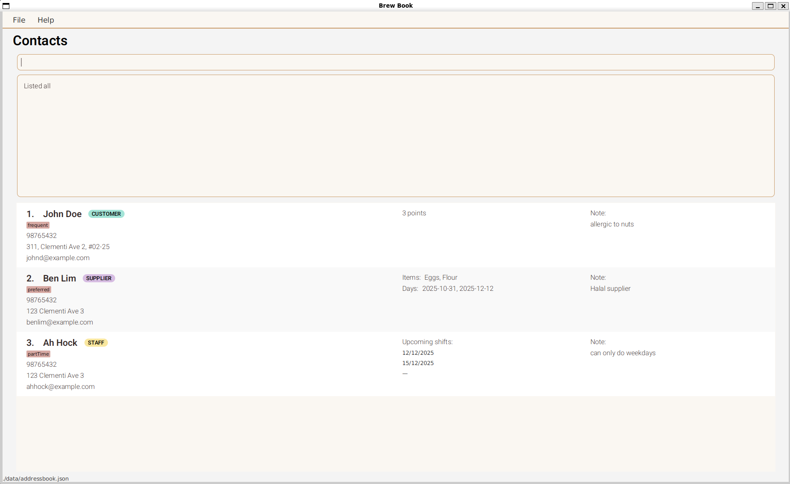

BrewBook is a **desktop app to help managers of small cafe to manage different contacts. Optimized for use via a Command Line Interface** (CLI) while still having the benefits of a Graphical User Interface (GUI). If you can type fast, BrewBook can get your contact management tasks done faster than traditional GUI apps.

* Table of Contents
{:toc}

--------------------------------------------------------------------------------------------------------------------

# Quick start

Welcome to **BrewBook** — your café’s one-stop contact manager for customers, staff, and suppliers.  
Follow these simple steps to get started — no technical experience needed!

---

## Step 1: Check that Java 17 is installed

BrewBook requires **Java 17** to run.  
Let’s check whether it’s already installed on your computer.

- **On Windows**
  1. Click the **Start Menu**, type `cmd`, and open **Command Prompt**.
  2. In the black window, type: `java -version`
  3. Press **Enter**.
- If you see something like:
  ```
  java version "17.0.10"
  ```
  ✅ Great! You already have Java 17 installed.
- If you see an older version (e.g. “11” or “8”) or an error saying **“java is not recognized”**, you’ll need to install Java 17.

👉 **To install Java 17:**  
Visit the official Java 17 download page [here](https://www.oracle.com/java/technologies/javase-jdk17-downloads.html).

Download the **Windows x64 Installer (JDK 17)** and follow the instructions on screen.  
When done, repeat the steps above to confirm it says **version 17**.

- **On Mac**

  1. Open **Terminal** (press **Command + Space**, type `Terminal`, and press **Enter**).
  2. Type: `java -version`
  3. Press **Enter**.
- If it shows something like `"17.0.x"`, ✅ you’re ready!
- If it says **“command not found”** or shows an older version, install Java 17.

👉 **To install Java 17 on macOS:**  
Go to [https://www.oracle.com/java/technologies/javase-jdk17-downloads.html](https://www.oracle.com/java/technologies/javase-jdk17-downloads.html)  
Download the **macOS Installer (JDK 17)** and follow the setup instructions.  
After installation, open Terminal again and run `java -version` to confirm it now shows version 17.

---

## Step 2: Download BrewBook

1. Go to the [BrewBook releases page](https://github.com/AY2526S1-CS2103T-T09-4/tp/releases).
2. Look for the latest version and click to download the file named **`BrewBook.jar`**.  
   (Think of this as your “BrewBook app.”)

---

## Step 3: Set up your BrewBook folder

1. Create a new folder anywhere you like — for example:
   - **Windows:** `C:\Users\Jean\Documents\BrewBook`
   - **macOS:** `/Users/Jean/Documents/BrewBook` or `~/Documents/BrewBook`
   - **Linux:** `/home/jean/Documents/BrewBook`
2. Move the downloaded **`BrewBook.jar`** file into that folder.  
      BrewBook will automatically save your data there each time you use it.

---

## Step 4: Open BrewBook

1. Find the **`BrewBook.jar`** file you downloaded.
2. **Double-click** it to open BrewBook.
3. Wait a few seconds — the main screen will appear with some sample contacts.



Now you’re ready to start managing your café contacts!

---

## Step 5: Try out a few simple commands

BrewBook uses a **command box** — just type what you want to do and press **Enter**.  
Here are a few examples you can try:

| Action | What to Type                                                                                                                                             | What It Does |
|--------|----------------------------------------------------------------------------------------------------------------------------------------------------------|--------------|
| Open help window | `help`                                                                                                                                                   | Shows a short guide on using BrewBook |
| View all contacts | `list all`                                                                                                                                               | Displays every contact saved |
| Add a customer | `add customer n/Ipum p/87122841 e/ipsum@example.com a/311, Bayfront 2, #02-25 points/3 notes/allergic to nuts t/frequent`                                | Adds a new customer |
| Add a staff member | `add staff n/Lorem p/98765432 e/lorem@example.com a/123 Clementi Ave 3 shifts/2026-12-04, 2026-12-07 notes/can only do weekdays t/partTime`              | Adds a new staff contact with a shift date |
| Add a supplier | `add supplier n/Dolor p/93376152 e/dolor@example.com a/123 Sengkang Ave 8 items/Flour, Eggs days/2026-10-10, 2026-10-20 notes/Halal supplier t/preferred` | Adds a supplier contact |
| Edit a contact | `edit 3 n\John Doe` | Edits any field of a contact  
| Delete a contact | `delete 3`                                                                                                                                               | Removes the 3rd contact from the current list |
| Exit the app | `exit`                                                                                                                                                   | Closes BrewBook safely |

💡 **Tip:** You can copy and paste commands from here directly into BrewBook.

---

## Step 6: Start using BrewBook for your café

That’s it — you’re ready to go!  
You can now use BrewBook to keep track of:
- Your **staff**, along with their shift schedules
- Your **suppliers**, including what and when they supply
- Your **customers**, and any notes you want to remember

BrewBook **automatically saves your data**, so there’s no need to click “Save.”  
When you open it next time, everything will still be there.

---

### Next step

Explore the [Features](#features) section below for a full list of commands and examples to help you manage your café even more efficiently.

--------------------------------------------------------------------------------------------------------------------

## Features

<div markdown="block" class="alert alert-info">

**:information_source: Notes about the command format:**<br>

* Words in `UPPER_CASE` are the parameters to be supplied by the user.<br>
  e.g. in `add n/NAME`, `NAME` is a parameter which can be used as `add n/John Doe`.

* Items in square brackets are optional.<br>
  e.g `n/NAME [t/TAG]` can be used as `n/John Doe t/friend` or as `n/John Doe`.

* Items with `…`​ after them can be used multiple times including zero times.<br>
  e.g. `[t/TAG]…​` can be used as ` ` (i.e. 0 times), `t/friend`, `t/friend t/family` etc.

* Parameters can be in any order.<br>
  e.g. if the command specifies `n/NAME p/PHONE_NUMBER`, `p/PHONE_NUMBER n/NAME` is also acceptable.
<!--
* Extraneous parameters for commands that do not take in parameters (such as `list`, `help`, `exit` and `clear`) will be ignored.<br>
  e.g. if the command specifies `list 123`, it will be interpreted as `list`.-->

* If you are using a PDF version of this document, be careful when copying and pasting commands that span multiple lines as space characters surrounding line-breaks may be omitted when copied over to the application.
</div>

<!--### Viewing help : `help`

Shows a message explaining how to access the help page.


Format: `help`
-->
### Adding a customer: `add customer`

Adds a customer to the address book.

Format: `add customer n/NAME p/PHONE_NUMBER e/EMAIL a/ADDRESS [points/POINTS] [n/NOTE] [t/TAG]…​`


<div markdown="span" class="alert alert-warning">:exclamation: **Constraints:** Points must be a non-negative integer.
</div>

Examples:
* `add customer n/John Doe p/98765432 e/johnd@example.com a/John street, block 123, #01-01`
* `add customer n/Betsy Crowe e/betsycrowe@example.com a/Newgate Rd p/1234567 notes/Loves chocolate points/3 t/allergy`

### Adding a staff: `add staff`

Adds a staff to the address book.

Format: `add staff n/NAME p/PHONE_NUMBER e/EMAIL a/ADDRESS shifts/SHIFT[, SHIFT,...][t/TAG]…`

Examples:
* `add staff n/John Doe p/98765432 e/johnd@example.com a/John street, block 123, #01-01 shifts/2026-11-11 notes/only weekends`
* `add staff n/Betsy Crowe t/friend e/betsycrowe@example.com a/Newgate Rd p/1234567 t/intern shifts/2026-11-13, 2026-11-12 notes/only weekends`

> ❗ **Constraints:**
> - Shift dates must be in the future.
> - Duplicate dates for shifts are not allowed.
> - Dates must follow the format `YYYY-MM-DD`.

### Adding a supplier: `add supplier`

Adds a supplier to the address book.

Format: `add supplier n/NAME p/PHONE_NUMBER e/EMAIL a/ADDRESS items/ITEMS[, ITEMS,...] days/DAYS[, DAYS,...] [t/TAG]…​`

<div markdown="span" class="alert alert-primary"> :bulb: **Tip:**
A supplier can have more than 1 item(s) and day(s) supplied
</div>

Examples:
* `add supplier n/John Doe p/98765432 e/johnd@example.com a/John street, block 123, #01-01 items/Coffee days/2025-12-11`
* `add supplier n/Betsy Crowe t/friend e/betsycrowe@example.com a/Newgate Prison p/1234567 items/Bread days/2025-12-09`

### Viewing contacts: `list`

Shows a list of all contacts in BrewBook, filtered by type.

Format: `list TYPE`

**Valid options for `TYPE`:**
- `all` — shows *all* contacts
- `customer` — shows only customers
- `staff` — shows only staff members
- `supplier` — shows only suppliers

Examples:
- `list all` → displays every contact saved in BrewBook
- `list customer` → shows only customers
- `list staff` → shows only your café’s employees
- `list supplier` → shows only your café’s suppliers

### Editing a person : `edit`

Edits an existing person in the address book.

Format: `edit INDEX [n/NAME] [p/PHONE] [e/EMAIL] [a/ADDRESS] [n/NOTE] [points/POINTS] [shifts/SHIFTS] [items/ITEMS] [days/DAYS] [t/TAG]…​`

* Edits the person at the specified `INDEX`. The index refers to the index number shown in the displayed person list. The index **must be a positive integer** 1, 2, 3, …​
* At least one of the optional fields must be provided.
* Existing values will be updated to the input values.
* When editing tags / shifts / items  / days, the existing fields of the person will be removed i.e adding is not cumulative. 
* You can remove all the person’s tags by typing `t/` without
    specifying any tags after it.

Examples:
*  `edit 1 p/91234567 e/johndoe@example.com` Edits the phone number and email address of the 1st person to be `91234567` and `johndoe@example.com` respectively.
*  `edit 2 n/Betsy Crower t/` Edits the name of the 2nd person to be `Betsy Crower` and clears all existing tags.

### Locating persons by name: `find`

Finds persons whose names contain any of the given keywords.

Format: `find KEYWORD [MORE_KEYWORDS]`

* The search is case-insensitive. e.g `hans` will match `Hans`
* The order of the keywords does not matter. e.g. `Hans Bo` will match `Bo Hans`
* Only the name is searched.
* Only full words will be matched e.g. `Han` will not match `Hans`
* Persons matching at least one keyword will be returned (i.e. `OR` search).
  e.g. `Hans Bo` will return `Hans Gruber`, `Bo Yang`

Examples:
* `find John` returns `john` and `John Doe`
* `find alex david` returns `Alex Yeoh`, `David Li`<br>
  

### Deleting a person : `delete`

Deletes the specified person or people from the address book.

Format: `delete INDEX[, INDEX, ...]`

Examples:
* `list all` followed by `delete 2` deletes the 2nd person in the address book.
* `list all` followed by `delete 1, 2` deletes the 1st & 2nd person in the address book.

> ❗ **Constraints:**
> - The index **must be a positive integer** 

### Sorting contacts: `sort`

Sorts your contact list based on a specific field and optional order — for example, by name in ascending order.  
This helps you quickly organize your list and find what you need.

Format: `sort FIELD`

**Valid options for `FIELD`:**
- `name` — sorts contacts alphabetically by name
- `phone` — sorts contacts by phone number
- `email` — sorts contacts alphabetically by email
- `address` — sorts contacts alphabetically by address
- `type` — sorts contacts by their role (customer, staff, or supplier)

Examples:
- `sort name` → sorts all contacts by name in ascending order (A–Z)
- `sort phone o/desc` → sorts contacts by phone number in descending order
- `sort type o/asc` → groups contacts by type (customer → staff → supplier) in ascending order

### Summarising important dates : `summary`

Displays all staff's shift and supplier's days.

Format: `summary`

### Clearing all entries : `clear`

Clears all entries from the address book.

Format: `clear`

<div markdown="span" class="alert alert-warning">:exclamation: **Caution:**
The clear command deletes all contacts in BrewBook. 
**There is no undo command** , please use with caution.
</div>

### Exiting the program : `exit`

Exits the program.

Format: `exit`

### Saving the data

BrewBook data are saved in the hard disk automatically after any command that changes the data. There is no need to save manually.
<!--
### Editing the data file

AddressBook data are saved automatically as a JSON file `[JAR file location]/data/addressbook.json`. Advanced users are welcome to update data directly by editing that data file.

<div markdown="span" class="alert alert-warning">:exclamation: **Caution:**
If your changes to the data file makes its format invalid, AddressBook will discard all data and start with an empty data file at the next run. Hence, it is recommended to take a backup of the file before editing it.<br>
Furthermore, certain edits can cause the AddressBook to behave in unexpected ways (e.g., if a value entered is outside of the acceptable range). Therefore, edit the data file only if you are confident that you can update it correctly.
</div>


--------------------------------------------------------------------------------------------------------------------

## FAQ

**Q**: How do I transfer my data to another Computer?<br>
**A**: Install the app in the other computer and overwrite the empty data file it creates with the file that contains the data of your previous AddressBook home folder.

--------------------------------------------------------------------------------------------------------------------

## Known issues

1. **When using multiple screens**, if you move the application to a secondary screen, and later switch to using only the primary screen, the GUI will open off-screen. The remedy is to delete the `preferences.json` file created by the application before running the application again.
2. **If you minimize the Help Window** and then run the `help` command (or use the `Help` menu, or the keyboard shortcut `F1`) again, the original Help Window will remain minimized, and no new Help Window will appear. The remedy is to manually restore the minimized Help Window.

--------------------------------------------------------------------------------------------------------------------

## Command summary

Action | Format, Examples
--------|------------------
**Add customer** | `add customer n/NAME p/PHONE_NUMBER e/EMAIL a/ADDRESS [t/TAG]…​` <br> e.g., `add n/James Ho p/22224444 e/jamesho@example.com a/123, Clementi Rd, 1234665 t/friend t/colleague`
**Add staff** | `add staff n/NAME p/PHONE_NUMBER e/EMAIL a/ADDRESS shifts/SHIFTS[, SHIFTS,...] [t/TAG]…​` <br> e.g., `add n/James Ho p/22224444 e/jamesho@example.com a/123, Clementi Rd, 1234665 shifts/2025-09-10 t/intern`
**Add suppplier** | `add supplier n/NAME p/PHONE_NUMBER e/EMAIL a/ADDRESS items/ITEMS[, ITEMS,...] days/DAYS[, DAYS,...] [t/TAG]…​` <br> e.g., `add n/James Ho p/22224444 e/jamesho@example.com a/123, Clementi Rd, 1234665 items/Coffee days/2025-10-30`
**List** | `list [all/customer/staff/supplier]`
**Delete** | `delete INDEX`<br> e.g., `delete 3`
<!--
**Clear** | `clear` 
**Edit** | `edit INDEX [n/NAME] [p/PHONE_NUMBER] [e/EMAIL] [a/ADDRESS] [t/TAG]…​`<br> e.g.,`edit 2 n/James Lee e/jameslee@example.com`
**Find** | `find KEYWORD [MORE_KEYWORDS]`<br> e.g., `find James Jake`
**Help** | `help`
-->
