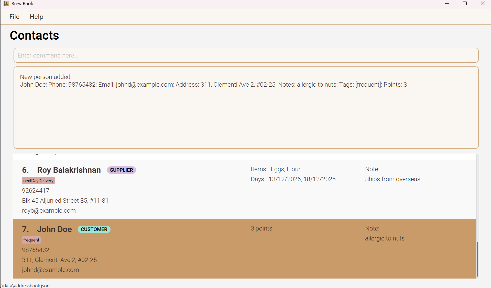
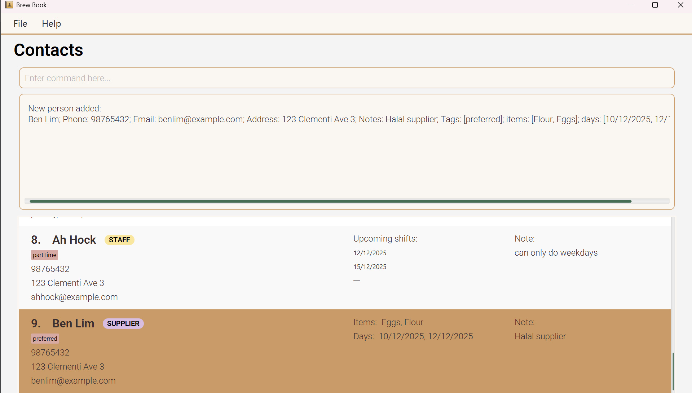
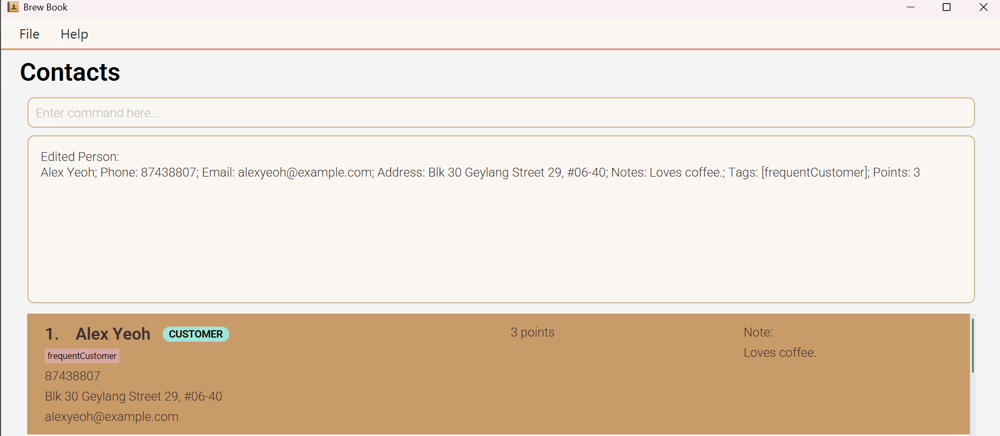
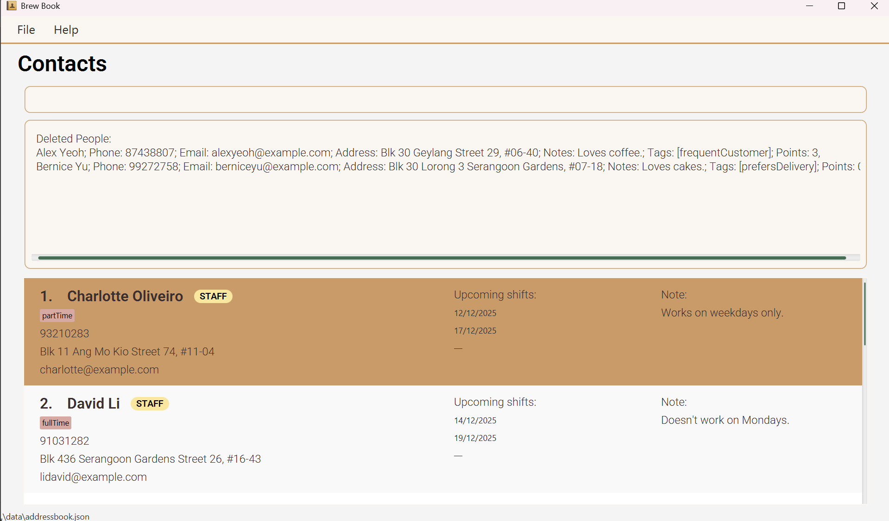
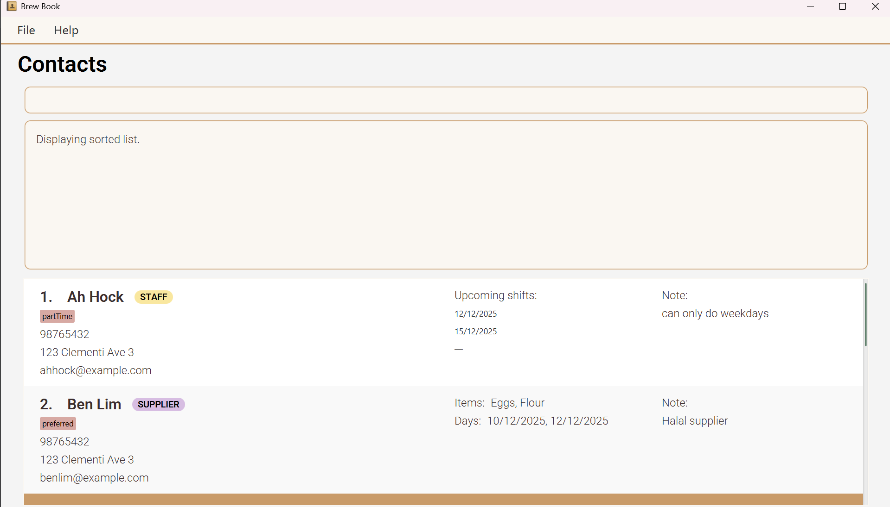
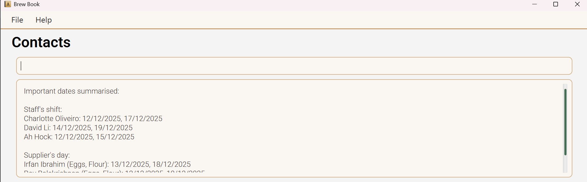

**Welcome to BrewBook! Your café’s command center.**
 Running a small café means juggling suppliers, staff, and loyal customers. BrewBook helps you keep all these relationships organized in one place.

- **Suppliers**: Track who provides your beans, pastries, or equipment, and keep their details handy for quick reorders.
- **Staff**: Store schedules, roles, and contact info so you can coordinate shifts effortlessly.
- **Customers**: Record regulars’ preferences, loyalty points or note down catering contacts to strengthen relationships.

Optimized for use via a Command Line Interface (CLI) while still having the benefits of a Graphical User Interface (GUI). If you can type fast, BrewBook can get your contact management tasks done faster than traditional GUI apps.

---

# Table of Contents
[How to use this guide](#how-to-use-this-guide) 
[Quick start](#quick-start) 
[Features](#features) 
[FAQ](#faq) 
[Known issues / Troubleshooting](#known-issues--troubleshooting) 
[Command Summary](#command-summary)  
---
# How to use this guide
This User Guide is designed to help you get the most out of BrewBook. You don't need to read it cover-to-cover,
instead we recommend you use it like a reference:

- **New users**: Start with the **Quick start** section. It walks you through installation, setup, and your very first commands.
- **Everyday use**: Jump to the **Features** section whenever you want to learn a specific command. Each command has:
  - A short description of what it does.
  - The exact format you need to type.
  - Examples you can copy and paste.
  - Notes on tips, constraints or special cases.
- **Troubleshooting**: Check the **FAQ** and **Known issues** sections if something doesn't work as expected.
- **At a glance**: Use the **Command summary** at the end for a quick reference to all commands in one place.

:bulb: **Tip:**
* Use the Table of Contents at the top of this page to jump directly to the section you need.

---
# Quick start

Welcome to **BrewBook** — your café’s one-stop contact manager for customers, staff, and suppliers.
Follow these simple steps to get started — no technical experience needed!

---
## Step 1: Check that Java 17 is installed

BrewBook requires **Java 17** to run.
Let’s check whether it’s already installed on your computer.

- **On Windows**
    1. Click the **Start Menu**, type `cmd`, and open **Command Prompt**.
    2. In the black window, type: `java -version`.
    3. Press **Enter**.

- **On Mac**
    1. Open **Terminal** (press **Command + Space**, type `Terminal`, and press **Enter**).
    2. Type: `java -version`.
    3. Press **Enter**.

- **On Linux**
    1. Open **Terminal** from your application menu.
    2. Type: `java -version`.
    3. Press **Enter**.

- If it shows something like `"17.0.x"`, you’re ready!
- If you see an older version (e.g. “11” or “8”) or an error saying **“java is not recognized”**, you’ll need to install Java 17.

:point_right: **To install Java 17:**
- **On Windows**
    1. Visit the official Java 17 download page [here](https://www.oracle.com/java/technologies/javase-jdk17-downloads.html). 
    2. Download the **Windows x64 Installer (JDK 17)** and follow the instructions on screen.
    3. When done, repeat the steps above to confirm it says **version 17**.

- **On Mac**
    1. Visit the official Java 17 download page [here](https://www.oracle.com/java/technologies/javase-jdk17-downloads.html)
    2. Download the **macOS Installer (JDK 17)** and follow the setup instructions.
    3. When done, repeat the steps above to confirm it says **version 17**.

- **On Linux**
    1. In the **Terminal**, enter the following:
    **Debian/Ubuntu (apt):**
       `sudo apt update`
       `sudo apt install openjdk-17-jdk`
    2. When done, repeat the steps above to confirm it says **version 17**.

---
## Step 2: Download BrewBook

1. Go to the [BrewBook releases page](https://github.com/AY2526S1-CS2103T-T09-4/tp/releases).
2. Look for the latest version and click to download the file named **`BrewBook.jar`**.
    (Think of this as your “BrewBook app.”)

---
## Step 3: Set up your BrewBook folder

1. Create a new folder anywhere you like — for example:
   - **Windows:** `C:\Users\Jean\Documents\BrewBook`
   - **macOS:** `/Users/Jean/Documents/BrewBook` or `~/Documents/BrewBook`
   - **Linux:** `/home/Jean/Documents/BrewBook`
2. Move the downloaded **`BrewBook.jar`** file into that folder.
      BrewBook will automatically save your data there each time you use it.

---
## Step 4: Open BrewBook

1. Open your **Command Prompt** or **Terminal**
2. Type `cd [folderpath]` to navigate to where your BrewBook.jar file exists.
    > If your .jar file is in the`Users\(name)\Downloads` directory and you are currently in `Users\(name)`,
    > you should type `cd Downloads` in the **Command Prompt** or **Terminal**.
3. Type `java -jar BrewBook.jar` and BrewBook will now open to its' landing page populated with sample data for your easy reference.

Now you’re ready to start managing your café contacts!

---
## Step 5: Try out a few simple commands

BrewBook uses a **command box** — just type a command exactly as shown below and press **Enter**.
Here are a few examples you can try:

| Action | What to Type                                                                                                                                  | What It Does                                          |
|--------|-----------------------------------------------------------------------------------------------------------------------------------------------|-------------------------------------------------------|
| Open help window | `help`                                                                                                                                        | Shows a short guide on using BrewBook                 |
| View all contacts | `list all`                                                                                                                                    | Displays every contact saved                          |
| Add a customer | `add customer n/Ipum p/87122841 e/ipsum@example.com a/311, Bayfront 2, #02-25 points/3 notes/allergic to nuts t/frequent`                     | Adds a new customer                                   |
| Add a staff member | `add staff n/Lorem p/98765432 e/lorem@example.com a/123 Clementi Ave 3 shifts/4/12/2026 notes/can only do weekdays t/partTime`                | Adds a new staff contact with a shift date            |
| Add a supplier | `add supplier n/Dolor p/93376152 e/dolor@example.com a/123 Sengkang Ave 8 items/Flour, Eggs days/10/10/2026 notes/Halal supplier t/preferred` | Adds a supplier contact                               |
| Edit a contact | `edit 3 n\John Doe`                                                                                                                           | Edits any field of a contact                          
| Delete a contact | `delete 2, 3`                                                                                                                                 | Removes the 2nd and 3rd contact from the current list |
| Exit the app | `exit`                                                                                                                                        | Closes BrewBook safely                                |

:bulb: **Tip:**
* You can copy and paste commands here directly into BrewBook.

You are now ready to utilise BrewBook for your own use case!
Explore the [Features](#features) section below for a full list of commands and examples to help you manage your café even more efficiently.

[Back to Table of Contents](#table-of-contents)

--------------------------------------------------------------------------------------------------------------------
# Features
[Viewing help](#viewing-help--help) 
[Adding a customer](#adding-a-customer-add-customer) 
[Adding a staff](#adding-a-staff-add-staff) 
[Adding a supplier](#adding-a-supplier-add-supplier) 
[Viewing contacts](#viewing-contacts-list) 
[Editing a contact](#editing-a-contact--edit) 
[Locating contact by keywords](#locating-contact-by-keywords-find) 
[Deleting contacts](#deleting-contacts--delete) 
[Sorting contacts](#sorting-contacts-sort) 
[Summarising important dates](#summarising-important-dates--summary) 
[Clearing all contacts](#clearing-all-entries--clear) 
[Exiting the program](#exiting-the-program--exit) 
[Saving the data](#saving-the-data)  
[Editing the data file](#editing-the-data-file)

**:information_source: Notes about the command format:** 

* Words in `UPPER_CASE` are the parameters to be supplied by the user. 
  e.g. in `add n/NAME`, `NAME` is a parameter which can be used as `add n/John Doe`.

* Items in square brackets are optional. 
  e.g `n/NAME [t/TAG]` can be used as `n/John Doe t/friend` or as `n/John Doe`.

* Items with `…`​ after them can be used multiple times including zero times. 
  e.g. `[t/TAG]…​` can be used as ` ` (i.e. 0 times), `t/friend`, `t/friend t/family` etc.

* Parameters can be in any order. 
  e.g. if the command specifies `n/NAME p/PHONE_NUMBER`, `p/PHONE_NUMBER n/NAME` is also acceptable.

* Command words are case-insensitive.
  e.g `list all` and `LIST all` are both valid ways to use the list command and will work successfully.

* If you are using a PDF version of this document, be careful when copying and pasting commands that 1 multiple lines as space characters surrounding line-breaks may be omitted when copied over to the application.

[Back to Table of Contents](#table-of-contents)

---
## Viewing help : `help`

Shows a message explaining how to access the help page.

*Figure: Help message leading to User Guide.*

**Format**: `help`

**Example**:
- `help` displays the help message with instructions on how to access the full help page.

[Back to Features](#features)

---
## Adding a customer: `add customer`

Adds a customer to the address book.

*Figure: Result from executing `add customer n/John Doe p/98765432 e/johnd@example.com a/311, Clementi Ave 2, #02-25 points/3 notes/allergic to nuts t/frequent`*

**Format**: `add customer n/NAME p/PHONE_NUMBER e/EMAIL a/ADDRESS [points/POINTS] [notes/NOTE] [t/TAG]…`

**Examples:**
- `add customer n/John Doe p/98765432 e/johnd@example.com a/John street, block 123, #01-01` adds a customer named *John Doe* with phone `98765432`, email `johnd@example.com`, and address `John street, block 123, #01-01`.
- `add customer n/Betsy Crowe e/betsycrowe@example.com a/Newgate Rd p/1234567 notes/Loves chocolate points/3 t/allergy` adds a customer named *Betsy Crowe* with phone `1234567`, email `betsycrowe@example.com`, address `Newgate Rd`, notes `Loves chocolate`, 3 loyalty points, and a tag `allergy`.

:bulb: **Tip:**
* If this is a new customer, you don't have to specify points as it will automatically be set to 0.

:exclamation: **Constraints:**
- Name must not exceed 48 characters.
- Phone number must not be less than 3 digits.
- Points must be a non-negative integer.

[Back to Features](#features)

---
## Adding a staff: `add staff`

Adds a staff to the address book.

*Figure: Result from executing `add staff n/Ah Hock p/98765432 e/ahhock@example.com a/123 Clementi Ave 3 shifts/12/12/2025, 15/12/2025 notes/can only do weekdays t/partTime`*

**Format**: `add staff n/NAME p/PHONE_NUMBER e/EMAIL a/ADDRESS [notes/NOTE] [shifts/SHIFT[, SHIFT]...][t/TAG]…`

**Examples:**
- `add staff n/Amy Lok p/98765431 e/amyl@example.com a/Amy street, block 123, #02-05 notes/only weekends` adds a staff member named *Amy Lok* with phone `98765431`, email `amyl@example.com`, address `Amy street, block 123, #01-01`, and notes `only weekends`.
- `add staff n/John Doe p/98765432 e/johnd@example.com a/John street, block 123, #01-01 shifts/11/11/2026 notes/only weekends` adds a staff member named *John Doe* with phone `98765432`, email `johnd@example.com`, address `John street, block 123, #01-01`, a single shift on `11/11/2026`, and notes `only weekends`.
- `add staff n/Betsy Crowe t/friend e/betsycrowe@example.com a/Newgate Rd p/1234567 t/intern shifts/13/11/2026, 12/11/2026 notes/only weekends` adds a staff member named *Betsy Crowe* with phone `1234567`, email `betsycrowe@example.com`, address `Newgate Rd`, tags `friend` and `intern`, shifts on `13/11/2026` and `12/11/2026`, and notes `only weekends`.

:bulb: **Tips:**
* Shifts are not needed if you are unsure when your staff is available to start!    
* Shifts are automatically deleted when the date has passed so you don't need to edit it!

:exclamation: **Constraints:**
  - Name must not exceed 48 characters.
  - Phone number must not be less than 3 digits.
  - Shifts date must be in the future.
  - Duplicate dates for shifts are not allowed.
  - Dates must follow the format `d/M/yyyy`.

[Back to Features](#features)

---
## Adding a supplier: `add supplier`

Adds a supplier to the address book.

*Figure: Result from executing: `add supplier n/Ben Lim p/98765432 e/benlim@example.com a/123 Clementi Ave 3 items/Flour, Eggs days/10/12/2025, 12/12/2025 notes/Halal supplier t/preferred`*

**Format**: `add supplier n/NAME p/PHONE_NUMBER e/EMAIL a/ADDRESS [items/ITEM[, ITEM]...] [days/DAY[, DAY]...] [notes/NOTES] [t/TAG]...`

**Examples**:
- `add supplier n/Amy Lok p/12345670  e/amyl@example.com a/Amy street, block 123, #01-05` adds a supplier named *Amy Lok* with phone `12345670`, email `amyl@example.com`, address `Amy street, block 123, #01-05`
- `add supplier n/John Doe p/98765432 e/johnd@example.com a/John street, block 123, #01-01 items/Coffee days/11/12/2025 notes/mainSupplier` adds a supplier named *John Doe* with phone `98765432`, email `johnd@example.com`, address `John street, block 123, #01-01`, supplying *Coffee* on `11/12/2025`, with notes `mainSupplier`.
- `add supplier n/Betsy Crowe t/friend e/betsycrowe@example.com a/Newgate Prison p/1234567 items/Bread days/9/12/2025` adds a supplier named *Betsy Crowe* with phone `1234567`, email `betsycrowe@example.com`, address `Newgate Prison`, supplying *Bread* on `9/12/2025`, and tagged as `friend`.

:bulb: **Tips:**
- Days or items are not needed if you are unsure what and when your supplier will resupply!    
- Days are automatically deleted when the date has passed so you don't need to edit it!

:exclamation: **Constraints:**
- Name must not exceed 48 characters.
- Phone number must not be less than 3 digits.
- Days date must be in the future.
- Duplicate dates for Days are not allowed.
- Days must follow the format `d/M/yyyy`.

[Back to Features](#features)

---
## Viewing contacts: `list`

Shows a list of all contacts in BrewBook, filtered by type.

*Figure: Result from executing `list customer` to show a list of all customers only*

**Format**: `list TYPE`

**Valid options for `TYPE`:**
- `all` — shows *all* contacts
- `customer` — shows only customers
- `staff` — shows only staff members
- `supplier` — shows only suppliers

**Examples**:
- `list all` Displays every contact saved in BrewBook.
- `list customer` Shows only customers.
- `list staff` Shows only your café’s employees.
- `list supplier` Shows only your café’s suppliers.

[Back to Features](#features)

---
## Editing a contact : `edit`

Edits an existing person in the address book.

*Figure: Result from executing `edit 1 n/Alex Yeoh` when the name was originally Alex Yeo*

**Format**: `edit INDEX [n/NAME] [p/PHONE] [e/EMAIL] [a/ADDRESS] [notes/NOTE] [points/POINTS] [shifts/SHIFT[, SHIFT]..] [items/ITEM[, ITEM]...] [days/DAY[, DAY]...] [t/TAG]…​`

**Examples**:
*  `edit 1 p/91234567 e/johndoe@example.com` edits the phone number and email address of the 1st person to be `91234567` and `johndoe@example.com` respectively.
*  `edit 2 n/Betsy Crower t/` edits the name of the 2nd person to be `Betsy Crower` and clears all existing tags.

:bulb: **Tips:**
- Existing values will be updated to the input values. Don't worry about needing to update with previous values!
- You can remove all a person's tags by typing `t/` without specifying any tags after it.

:exclamation: **Constraints:**
- The index must be a positive integer.
- At least one optional fields must be provided.
- Editing `tags`/`shifts`/`items`/`days`, the existing fields of the person will be removed (i.e adding is not cumulative).

[Back to Features](#features)

---
## Locating contact by keywords: `find`

Finds contacts whose fields contain any of the given keywords.

*Figure: Result from executing `find Alex`*

**Format**: `find KEYWORD [MORE_KEYWORDS]`

**Examples**:
- `find John` returns a person named *john* and *John Doe*.
- `find n/alex p/12345678` returns a person named *Alex Yeoh* who has phone number `12345678`.  

:bulb: **Tips:**
- The search is case-insensitive so don't worry about capitalisation!
- Persons matching all parameters will be returned (i.e. AND search).
- If no prefix is specified, find will resort to search by name for the given keyword.

[Back to Features](#features)

---
## Deleting contacts : `delete`

Deletes the specified person or people from the address book.

*Figure: Result from executing `delete 1, 2` to delete Alex and Bernice*

**Format**: `delete INDEX[, INDEX, ...]`

**Examples**:
* `list all` followed by `delete 2` deletes the 2nd person in the address book.
* `find alex` followed by `delete 1, 2` deletes the 1st & 2nd person in the address book following the index of the new list.

:exclamation: **Constraint:**
  - The index must be a positive integer.

[Back to Features](#features)

---
### Sorting contacts: `sort`

Sorts your contact list based on a specific field and optional order. If no order is given, it will be assumed to be in ascending order.

*Figure: Result from executing `sort name` such that contacts are now in alphabetical order*

**Format**: `sort FIELD [o/ORDER]`

**Valid options for `FIELD`:**
- `name` — sorts contacts alphabetically by name.
- `phone` — sorts contacts by phone number.
- `email` — sorts contacts alphabetically by email.
- `address` — sorts contacts alphabetically by address.
- `type` — sorts contacts by their role (customer, staff, or supplier).

**Valid options for `ORDER`:**
- `asc` — sorts in ascending order.
- `desc` — sorts in descending order.

**Examples**:
- `sort name` sorts all contacts by name in ascending order (A–Z).
- `sort phone o/desc` sorts contacts by phone number in descending order.
- `sort type o/asc` groups contacts by type (customer → staff → supplier) in ascending order.

[Back to Features](#features)

---
## Summarising important dates : `summary`

Displays all staff's shift and supplier's days.

*Figure: Result from executing `summary`*

**Format**: `summary`

**Example**:
- `summary` shows a consolidated list of upcoming shift dates for all staff and delivery days and items for all suppliers.

[Back to Features](#features)

---
## Clearing all entries : `clear`

*Figure: Result from executing `clear`, deleting all contacts*

Clears all entries from the address book.

**Format**: `clear`

**Example**:
- `clear` deletes all entries from the address book.

:exclamation: **Constraints:**
- The clear command deletes all contacts in BrewBook.
- This action cannot be undone.

[Back to Features](#features)

---
## Exiting the program : `exit`

Exits the program.

**Format**: `exit`

**Example**: 
- `exit` closes the application window and terminates the program.

[Back to Features](#features)

---
## Saving the data

BrewBook data are saved in the hard disk automatically after any command that changes the data. There is no need to save manually.

[Back to Features](#features)

---
## Editing the data file

BrewBook data are saved automatically as a JSON file `[JAR file location]/data/brewbook.json`. Advanced users are welcome to update data directly by editing that data file.

:exclamation: **Caution:**
- If your changes to the data file makes its format invalid, BrewBook will discard all data and start with an empty data file at the next run. Hence, it is recommended to take a backup of the file before editing it. 
- Furthermore, certain edits can cause the BrewBook to behave in unexpected ways (e.g., if a value entered is outside of the acceptable range). Therefore, edit the data file only if you are confident that you can update it correctly.

[Back to Features](#features)
--------------------------------------------------------------------------------------------------------------------
# FAQ

**Q**: How do I transfer my data to another computer? 
**A**: You can transfer your data by following the steps below.
1. Install BrewBook on the new computer.
2. Launch it once to generate a fresh data file.
3. Locate the data file on your old computer (usually in the BrewBook home folder).
4. Copy that file to the new computer and overwrite the newly created one.

**Q**: What happens if I accidentally run `clear`? 
**A**: All data will be permanently deleted. There is no undo.  
**To prevent data loss:**
- Before using `clear`, locate your data file and make a backup copy.
- Store the backup in a safe folder or cloud drive.

**Q**: Where is my data stored? 
**A**: BrewBook stores data in a local file inside the same folder as your BrewBook.jar.

**Q**: Can I undo a delete command? 
**A**: No. Once an entry is deleted using `delete`, it cannot be recovered.  
**To avoid accidental deletes:**
- Use `list` first to confirm the index.
- Back up your data file regularly.

**Q**: Why isn’t my command working? 
**A**: Please check the following.
- Check that your command follows the correct format.
- Make sure required fields like `n/`, `p/`, or `e/` are included.
- Use `help` to view all available commands and examples on how to use them along with their constraints.

**Q**: Can I add multiple tags or items at once? 
**A**: Yes. Please refer to add command to see how to do it.

**Q**: What date format should I use? 
**A**: Use `d/M/yyyy` for all date inputs.  
**Examples:**
- `shifts/11/12/2025`
- `days/9/12/2025, 16/12/2025`

**Q**: Can I use BrewBook on mobile? 
**A**: No. BrewBook is currently designed for desktop use only.

[Back to Table of Contents](#table-of-contents)

--------------------------------------------------------------------------------------------------------------------
# Known issues / Troubleshooting

1. **When using multiple screens**, if you move the application to a secondary screen, and later switch to using only the primary screen, the GUI will open off-screen. The remedy is to delete the `preferences.json` file (located in same folder as BrewBook.jar) created by the application before running the application again.
2. **If you minimize the Help Window** and then run the `help` command (or use the `Help` menu, or the keyboard shortcut `F1`) again, the original Help Window will remain minimized, and no new Help Window will appear. The remedy is to manually restore the minimized Help Window.
3. **Once you select a contact card**, you will not be able to unselect it.
4. **BrewBook does not accept names with special symbols** such as '/', if you require, you may spell out the name in full as we allow a maximum of 48 number of character for name.

[Back to Table of Contents](#table-of-contents)

--------------------------------------------------------------------------------------------------------------------
# Command summary

Action | Format, Examples
--------|------------------
**Add customer** | `add customer n/NAME p/PHONE_NUMBER e/EMAIL a/ADDRESS [points/POINTS] [notes/NOTE] [t/TAG]…​`   e.g., `add customer n/Betsy Crowe e/betsycrowe@example.com a/Newgate Rd p/1234567 notes/Loves chocolate points/3 t/allergy`
**Add staff** | `add staff n/NAME p/PHONE_NUMBER e/EMAIL a/ADDRESS [notes/NOTE] [shifts/SHIFT[, SHIFT]...] [t/TAG]…`   e.g., `add staff n/Ah Hock p/98765432 e/ahhock@example.com a/123 Clementi Ave 3 shifts/12/4/2025 notes/can only do weekdays t/partTime`
**Add supplier** | `add supplier n/NAME p/PHONE_NUMBER e/EMAIL a/ADDRESS [items/ITEMS[, ITEMS]...] [days/DAYS[, DAYS]...] [notes/NOTES] [t/TAG]...​`   e.g., `add supplier n/James Ho p/22224444 e/jamesho@example.com a/123, Clementi Rd, 1234665 items/Coffee days/28/10/2025`
**List** | `list [all/customer/staff/supplier]`
**Delete** | `delete INDEX[, INDEX, ...]`  e.g., `delete 3, 2, 1`
**Clear** | `clear`
**Edit** | `edit INDEX [n/NAME] [p/PHONE] [e/EMAIL] [a/ADDRESS] [notes/NOTE] [points/POINTS] [shifts/SHIFT[, SHIFT]...] [items/ITEMS[, ITEMS]...] [days/DAYS[, DAYS]...] [t/TAG]…​`  e.g.,`edit 1 p/91234567 e/johndoe@example.com`
**Find** | `find KEYWORD [MORE_KEYWORDS]`  e.g., `find James Jake`
**Help** | `help`

[Back to Table of Contents](#table-of-contents)
